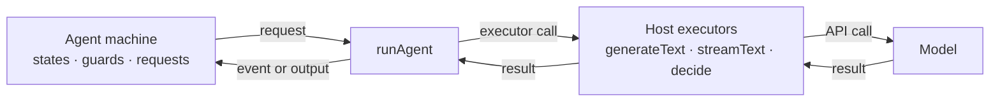

> **Alpha:** `@statelyai/agent` 2.0 is in alpha. APIs can change between releases; pin an exact version. Feedback: [github.com/statelyai/agent](https://github.com/statelyai/agent/issues).

`@statelyai/agent` lets you author an AI agent as a typed XState state machine. The machine is a portable blueprint of what your agent can do; it never talks to a model directly.

- The **machine** declares states, legal transitions and guards, the model calls each state makes, and the events the model may choose right now.
- The **host** supplies executors: three plain functions (`generateText`, `streamText`, `decide`) taking plain request objects and returning plain results.
- `runAgent` sits between them, calling an executor whenever the machine needs a model.

**The machine decides, the host executes.**



Because the machine only knows the executor contract, the same machine runs unchanged against the Vercel AI SDK, Cloudflare Workers AI, a raw provider fetch, or scripted answers in a test.

A [decision](decisions.md) is where this matters most: the model chooses exactly one **currently-legal** machine event, not free text and not an arbitrary tool call. An illegal choice is rejected before it takes effect, so illegal behavior is impossible by construction rather than discouraged by a prompt.

## Compared to a plain loop

Most agents start as a `while` loop around a model call. That works until:

- **State goes implicit.** Which step you are on lives in local variables and `if` chains; nothing can enumerate, diagram, or verify the paths.
- **Legality is prompt-enforced.** Nothing stops the model from calling a tool at the wrong time; you can only ask it nicely.
- **Pausing means rearchitecting.** Waiting for a human, surviving a deploy, or resuming on another worker requires serializing ad-hoc loop state by hand.
- **Testing needs the model.** Every branch is buried behind live calls, so tests mock the SDK instead of asserting on structure.

A state machine makes each of these a declared, checkable property instead of a convention. The loop is still there; the library owns it. See [Migrating from a loop](from-a-loop.md) for the mechanical translation.

## Benefits of state machines

- **Legal by construction.** The machine and its guards define every path. The model cannot drive the agent into a state you did not author.
- **Portable.** No dependency on any model SDK. Swap hosts, not agents.
- **Inspectable.** States, transitions, and requests are data you can read, diagram, and reason about before anything runs.
- **Serializable.** Every settle point produces a plain JSON snapshot. Persist it anywhere and resume later.

## Example

<!-- setup + invoke + run; full walkthrough lives in quickstart.md -->

```ts
import { z } from "zod";
import { runAgent, setupAgent } from "@statelyai/agent";
import { createAiSdkExecutors, defineModels } from "@statelyai/agent/ai-sdk";
import { openai } from "@ai-sdk/openai";

const models = defineModels({ quick: openai("gpt-5.4-mini") });
const answerSchema = z.object({ answer: z.string() });

const agentSetup = setupAgent({
  models,
  context: z.object({ prompt: z.string(), answer: z.string().nullable() }),
  input: z.object({ prompt: z.string() }),
  output: answerSchema,
  requests: {
    answerQuestion: {
      schemas: { input: z.object({ prompt: z.string() }), output: answerSchema },
      model: "quick",
      prompt: ({ input }) => input.prompt,
    },
  },
});

const machine = agentSetup.createMachine({
  context: ({ input }) => ({ prompt: input.prompt, answer: null }),
  initial: "answering",
  states: {
    answering: {
      invoke: {
        src: "answerQuestion",
        input: ({ context }) => ({ prompt: context.prompt }),
        onDone: ({ output }) => ({ target: "done", context: { answer: output.answer } }),
      },
    },
    done: { type: "final", output: ({ context }) => ({ answer: context.answer ?? "" }) },
  },
});

const result = await runAgent(machine, {
  input: { prompt: "Why state machines?" },
  executors: createAiSdkExecutors({ models }),
});

if (result.status === "done") console.log(result.output.answer);
```

## Three starting points

- **Author a new agent.** Describe states, decisions, and typed requests, run locally with `runAgent`, then test and inspect it with no API key. Start at the [Quickstart](quickstart.md).
- **Retrofit an existing agent.** Your existing SDK calls, tools, and retry code become the executors; the machine replaces only the control flow. See [Migrating from a loop](from-a-loop.md).
- **Copy a known pattern.** ReAct, reflection, plan-and-execute, RAG, supervisor, swarm handoff, each a single runnable file. Browse [Agent patterns](patterns.md).

## Core pages

- [Quickstart](quickstart.md): install and run your first agent machine end to end.
- [Agent machines](machines.md): `setupAgent`, states, invokes, typed context, built-in actor sources, and guards.
- [Decisions](decisions.md): the model choosing exactly one currently-legal machine event.
- [Hosts and executors](hosts.md): the executor contract, the AI SDK adapter, and writing your own.
- [Use in any stack](any-stack.md): one machine, run locally, behind an HTTP route, or on the edge.
- [Testing and verification](verify.md): lint, simulate, and explore agent machines with no API keys.

Everything else is in the sidebar: [text requests](text-requests.md), [tools](tools.md), [plans](plans.md), [messages](messages.md), [debugging](debugging.md), [human in the loop](human-in-the-loop.md), [observability](observability.md), [usage and budgets](usage-and-budgets.md), [the event log](event-log.md), [multi-agent](multi-agent.md), [evals](evals.md), [scope](scope.md), and the [roadmap](roadmap.md).

## Alpha status

The API changed completely in 2.0 and is still settling. Expect breaking changes before 2.0 stable.

Explicitly not shipped yet:

- **Postgres and Redis storage adapters.** Core ships the persistence contracts, an in-memory event-log store, and SQLite stores on `node:sqlite` ([`@statelyai/agent/sqlite`](event-log.md#sqlite-stores)), but nothing for other databases.
- **OpenTelemetry exporter.** Build your own from the observation callbacks on `runAgent`.
- **SSE/WebSocket transport helpers.** Host your own stream over what `onChunk` gives you.
- **Agent-specific dynamic fan-out helper.** Dynamic fan-out works today through XState `spawn(...)` or `Promise.all(...)` inside a host actor; core has no higher-level helper for branch binding and progress.
- **Visualization tooling.** Stately Studio and a VS Code extension own diagramming and inspection.

If something here blocks you, or the API surface feels wrong, open an issue. This alpha exists to find that out before 2.0 stable.
