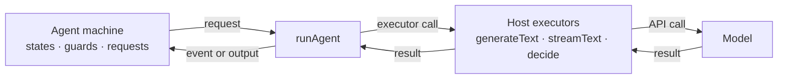

> **Alpha:** `@statelyai/agent` 2.0 is in alpha. APIs can change between releases; pin an exact version. Feedback: [github.com/statelyai/agent](https://github.com/statelyai/agent/issues).

`@statelyai/agent` lets you author an AI agent as a typed XState state machine. The machine is a portable blueprint of what your agent can do; it never talks to a model directly.

- The **machine** declares states, legal transitions and guards, the model calls each state makes, and the events the model may choose right now.
- The **host** supplies executors: three plain functions (`generateText`, `streamText`, `decide`) taking plain request objects and returning plain results.
- `runAgent` sits between them, calling an executor whenever the machine needs a model.

**The machine decides, the host executes.**



Because the machine only knows the executor contract, the same machine runs unchanged against the Vercel AI SDK, Cloudflare Workers AI, a raw provider fetch, or scripted answers in a test.

A [decision](decisions.md) is where this matters most: the model chooses exactly one **currently-legal** machine event, not free text and not an arbitrary tool call. An illegal choice is rejected before it takes effect, so illegal behavior is impossible by construction rather than discouraged by a prompt.

## Install

<!-- install command matching the package prerelease channel and package.json peers -->

```bash
pnpm add @statelyai/agent@alpha xstate@alpha zod ai@^6 @ai-sdk/openai@^3
```

- Node 22.18 or newer, XState v6 alpha.25 or newer. `xstate` is the only required peer.
- `ai` and `@ai-sdk/openai` back the shipped adapter, `createAiSdkExecutors`. Core has no runtime dependency besides `xstate`.
- The `@alpha` tag floats: install once, then pin what it resolved to.
- ESM-first (a CommonJS build ships too). The example below uses top-level `await`, so set `"type": "module"`.

Version and peer detail, plus the same agent built up step by step, are in the [Quickstart](quickstart.md).

## Your first agent

<!-- setup + invoke + run; full walkthrough lives in quickstart.md -->

One request, one state, one run. Save as `agent.ts` and run it with `npx tsx agent.ts`.

```ts
import { z } from "zod";
import { runAgent, setupAgent } from "@statelyai/agent";
import { createAiSdkExecutors, defineModels } from "@statelyai/agent/ai-sdk";
import { openai } from "@ai-sdk/openai";

const models = defineModels({ quick: openai("gpt-5.4-mini") });
const answerSchema = z.object({ answer: z.string() });

const agentSetup = setupAgent({
  models,
  context: z.object({ prompt: z.string(), answer: z.string().nullable() }),
  input: z.object({ prompt: z.string() }),
  output: answerSchema,
  requests: {
    answerQuestion: {
      schemas: { input: z.object({ prompt: z.string() }), output: answerSchema },
      model: "quick",
      prompt: ({ input }) => input.prompt,
    },
  },
});

const machine = agentSetup.createMachine({
  context: ({ input }) => ({ prompt: input.prompt, answer: null }),
  initial: "answering",
  states: {
    answering: {
      invoke: {
        src: "answerQuestion",
        input: ({ context }) => ({ prompt: context.prompt }),
        onDone: ({ output }) => ({ target: "done", context: { answer: output.answer } }),
      },
    },
    done: { type: "final", output: ({ context }) => ({ answer: context.answer ?? "" }) },
  },
});

const result = await runAgent(machine, {
  input: { prompt: "Why state machines?" },
  executors: createAiSdkExecutors({ models }),
});

if (result.status === "done") console.log(result.output.answer);
```

That is the whole shape. Everything it does not show has an owning page:

- `setupAgent` and `createMachine`: [Agent machines](machines.md).
- Named `requests` and their schemas: [Text requests](text-requests.md).
- Swapping `createAiSdkExecutors` for `createScriptedExecutors` to run with **no API key**, letting the model choose an event, and guards that overrule it: the [Quickstart](quickstart.md).
- `runAgent` versus `provideExecutors` versus the step path: [Choosing a run mode](choosing-a-run-mode.md).

## Compared to a plain loop

Most agents start as a `while` loop around a model call. That works until:

- **State goes implicit.** Which step you are on lives in local variables and `if` chains; a machine's states, transitions, and requests are data you can read, diagram, and reason about before anything runs.
- **Legality is prompt-enforced.** Nothing stops the model from calling a tool at the wrong time; a machine and its guards define every path, so the model cannot drive the agent into a state you did not author.
- **Pausing means rearchitecting.** Waiting for a human, surviving a deploy, or resuming on another worker means serializing ad-hoc loop state by hand; every machine settle point produces a plain JSON snapshot you persist anywhere.
- **Testing needs the model.** Every branch is buried behind live calls, so tests mock the SDK instead of asserting on structure.
- **The SDK is baked in.** A loop is written against one provider's API; a machine depends on no model SDK, so you swap hosts, not agents.

A state machine makes each of these a declared, checkable property instead of a convention. The loop is still there; the library owns it. See [Migrating from a hand-rolled loop](from-a-loop.md) for the mechanical translation.

## Three starting points

- **Author a new agent.** Describe states, decisions, and typed requests, run locally with `runAgent`, then test and inspect it with no API key. Start at the [Quickstart](quickstart.md).
- **Retrofit an existing agent.** Your existing SDK calls, tools, and retry code become the executors; the machine replaces only the control flow. See [Migrating from a hand-rolled loop](from-a-loop.md).
- **Copy a known pattern.** ReAct, reflection, plan-and-execute, RAG, supervisor, swarm handoff, each a single runnable file. Browse [Agent patterns](patterns.md).

## Sidebar map

- **Get started**: [Quickstart](quickstart.md), [Thinking in state machines](thinking-in-state-machines.md), [Scope](scope.md).
- **Core concepts**: [Agent machines](machines.md), [Decisions](decisions.md), [Text requests](text-requests.md), [Tools](tools.md), [Messages](messages.md), [Preset machines](machines-presets.md).
- **Running agents**: [Choosing a run mode](choosing-a-run-mode.md), [Hosts and executors](hosts.md), [Use in any stack](any-stack.md), [The step path](steps.md).
- **State and durability**: [Where state lives](persistence.md), [The event log](event-log.md), [Human in the loop](human-in-the-loop.md).
- **Production**: [Models and providers](models-and-providers.md), [Observability](observability.md), [Usage and budgets](usage-and-budgets.md), [Debugging](debugging.md), [Multi-agent](multi-agent.md).
- **Machines as data**: [Machines as data](machines-as-data.md), [Generating machines](generate-machines.md).
- **Testing**: [Testing and verification](verify.md), [Evals](evals.md).
- **For LangGraph users**: [Comparison](langgraph-comparison.md), [Migrating](from-langgraph.md), [Migrating from a hand-rolled loop](from-a-loop.md).
- **Resources**: [Agent patterns](patterns.md), [Post-alpha roadmap](roadmap.md).

## Alpha status

The API changed completely in 2.0 and is still settling. Expect breaking changes before 2.0 stable.

What is deliberately not shipped yet (storage adapters beyond SQLite, transport helpers, a fan-out helper, and more) is listed on the [Post-alpha roadmap](roadmap.md).

If something here blocks you, or the API surface feels wrong, open an issue. This alpha exists to find that out before 2.0 stable.
