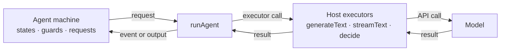

> **Alpha:** `@statelyai/agent` 2.0 is in alpha. APIs can change between releases; pin an exact version. Feedback: [github.com/statelyai/agent](https://github.com/statelyai/agent/issues).

`@statelyai/agent` lets you author an AI agent as a typed XState state machine. The machine describes what your agent can do. It never calls a model directly.

- The **machine** declares states, transitions, guards, the model calls each state makes, and the events the model may choose in the current state.
- The **host** supplies executors. These are three functions named `generateText`, `streamText`, and `decide`. Each takes a request object and returns a result object.
- `runAgent` connects the two. It calls an executor whenever the machine needs a model. It settles as `done`, `idle`, or `error`. `generateResult` is the variant for runs that must finish: it returns the done result and throws `AgentIdleError` when the run settles idle instead.



The machine knows only the executor contract. The same machine runs unchanged against the Vercel AI SDK, Cloudflare Workers AI, a raw provider fetch, or scripted answers in a test.

In a [decision](decisions.md), the model chooses exactly one machine event that is legal in the current state. It does not return free text and it does not call an arbitrary tool. The machine rejects an illegal choice before it takes effect.

## Install

<!-- install command matching the package prerelease channel and package.json peers -->

```bash
pnpm add @statelyai/agent@alpha xstate@alpha zod ai@^7 @ai-sdk/openai@^4
```

Requires Node 22.18 or newer. `xstate` is the only required peer dependency. `ai` and `@ai-sdk/openai` back the shipped adapter, `createAiSdkExecutors`. The example below uses top-level `await`, so set `"type": "module"` in `package.json`.

Read more about versions, peers, and pinning the alpha in the [Quickstart](quickstart.md#installation).

## Your first agent

<!-- setup + invoke + run; full walkthrough lives in quickstart.md -->

This agent has one request, one state, and one run. Save it as `agent.ts` and run it with `npx tsx agent.ts`.

<!-- viz: two-state machine: answering (invoke answerQuestion) -> done (final, outputs answer) -->


```ts
import { z } from "zod";
import { runAgent, setupAgent } from "@statelyai/agent";
import { createAiSdkExecutors, defineModels } from "@statelyai/agent/ai-sdk";
import { openai } from "@ai-sdk/openai";

// `gpt-5.4-mini` is an illustrative model ID. Use one your provider supports.
const models = defineModels({ quick: openai("gpt-5.4-mini") });
const answerSchema = z.object({ answer: z.string() });

const agentSetup = setupAgent({
  models,
  context: z.object({ prompt: z.string(), answer: z.string().nullable() }),
  input: z.object({ prompt: z.string() }),
  output: answerSchema,
  requests: {
    answerQuestion: {
      schemas: { input: z.object({ prompt: z.string() }), output: answerSchema },
      model: "quick",
      prompt: ({ input }) => input.prompt,
    },
  },
});

const machine = agentSetup.createMachine({
  context: ({ input }) => ({ prompt: input.prompt, answer: null }),
  initial: "answering",
  states: {
    answering: {
      invoke: {
        src: "answerQuestion",
        input: ({ context }) => ({ prompt: context.prompt }),
        onDone: ({ output }) => ({ target: "done", context: { answer: output.answer } }),
      },
    },
    done: { type: "final", output: ({ context }) => ({ answer: context.answer ?? "" }) },
  },
});

const result = await runAgent(machine, {
  input: { prompt: "Why state machines?" },
  executors: createAiSdkExecutors({ models }),
});

if (result.status === "done") console.log(result.output.answer);
```

Each part of this example has an owning page:

- `setupAgent` and `createMachine`: [Agent machines](machines.md).
- Named `requests` and their schemas: [Text requests](text-requests.md).
- Replacing `createAiSdkExecutors` with `createScriptedExecutors` to run without an API key, letting the model choose an event, and writing guards that override that choice: the [Quickstart](quickstart.md).
- Choosing between `runAgent`, `provideExecutors`, and the step path: [Choosing a run mode](choosing-a-run-mode.md).

## Compared to a plain loop

Most agents start as a `while` loop around a model call. A loop has the following limitations:

- The current step lives in local variables and `if` chains. A machine's states, transitions, and requests are data you can read, diagram, and reason about before the agent runs.
- Nothing stops the model from calling a tool at the wrong time. A machine and its guards define every path, so the model cannot move the agent into a state you did not author.
- Pausing requires serializing loop state by hand. This applies when you wait for a human, redeploy, or resume on another worker. A machine produces a JSON snapshot at every settle point, and you can persist that snapshot anywhere.
- Testing requires the model, because every branch sits behind a live call. Tests then mock the SDK instead of asserting on structure.
- A loop is written against one provider's API. A machine depends on no model SDK, so you replace the host instead of the agent.

A state machine turns each of these into a declared property you can check before the agent runs. The library owns the loop. See [Migrating from a hand-rolled loop](from-a-loop.md) for the translation.

## Starting points

- To author a new agent, describe states, decisions, and typed requests, run them locally with `runAgent`, then test and inspect the agent without an API key. Start at the [Quickstart](quickstart.md).
- To retrofit an existing agent, turn your existing SDK calls, tools, and retry code into executors. The machine replaces only the control flow. See [Migrating from a hand-rolled loop](from-a-loop.md).
- To copy a known pattern, browse [Agent patterns](patterns.md). ReAct, reflection, plan-and-execute, RAG, supervisor, and swarm handoff are each a single runnable file.

## Package entry points

<!-- entry points from package.json#exports -->

| Import path | Contents |
| ----------- | -------- |
| `@statelyai/agent` | `setupAgent`, `runAgent`, `generateResult`, the step helpers, and the verification APIs. |
| `@statelyai/agent/ai-sdk` | `createAiSdkExecutors`, `defineModels`, and the Vercel AI SDK mappers. |
| `@statelyai/agent/machines` | The [preset machines](machines-presets.md), such as `createToolLoopMachine` and `createRouterMachine`. |
| `@statelyai/agent/otel` | `createOtelTraceHandler`, which maps trace events to OpenTelemetry spans. |
| `@statelyai/agent/sqlite` | `createSqliteEventLogStore` and `createSqliteSnapshotStore`. |
| `@statelyai/agent/validate` | `validateAgentConfig`, which checks a JSON machine config against the schema. Requires `ajv`. |
| `@statelyai/agent/agent-workflow.json` | The JSON Schema for machine configs. See [Machines as data](machines-as-data.md). |

## Alpha status

The API changed completely in 2.0 and is still settling. Expect breaking changes before 2.0 stable.

Some features are deliberately not shipped yet, including storage adapters beyond SQLite, transport helpers, and a fan-out helper. See the [Post-alpha roadmap](roadmap.md) for the full list.

If something here blocks you, or the API surface seems wrong, open an issue.
