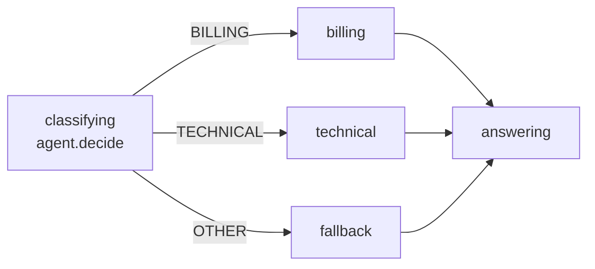
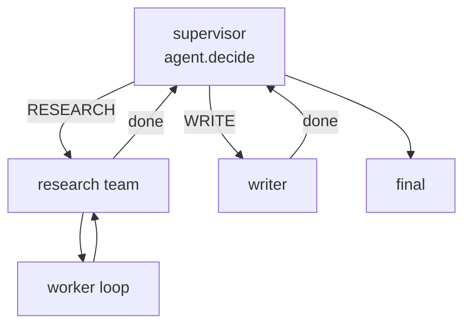
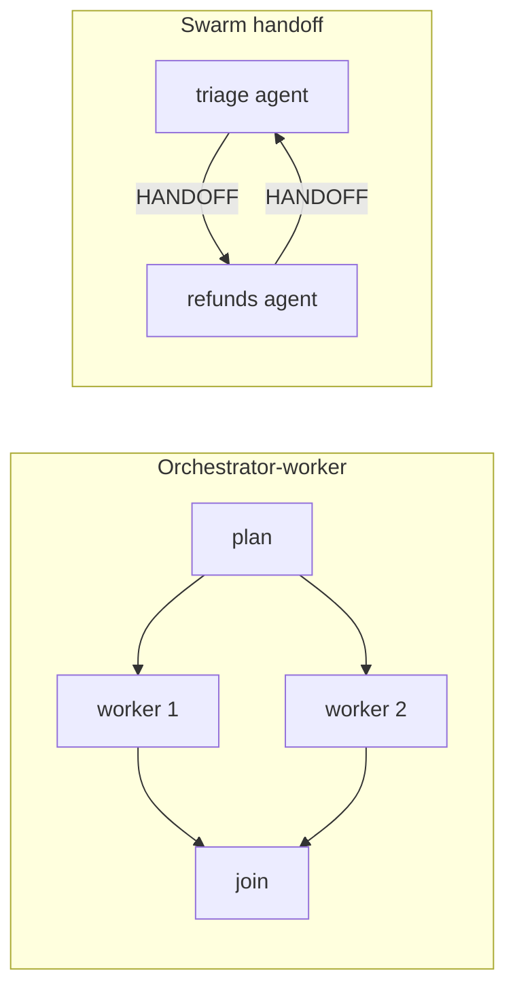

> **Alpha:** `@statelyai/agent` 2.0 is in alpha. APIs can change between releases; pin an exact version. Feedback: [github.com/statelyai/agent](https://github.com/statelyai/agent/issues).

This page maps common agent patterns to runnable examples. Each pattern is a control-flow shape such as a loop, a branch, a fan-out, or a handoff, written as an explicit XState machine. Pick a pattern, open its example, and copy the file. Each section ends with a canonical example, meaning the smallest example that demonstrates the pattern completely. Start there. See [Lifting an example](#lifting-an-example) at the end of this page for the dependencies and TypeScript settings an example needs.

## Core ideas

These examples cover text requests, decisions, messages, and JSON authoring.

- [twenty-questions](../examples/twenty-questions/index.ts): a decision loop where the model picks one legal event, ASK or GUESS, per turn. Legality is guard-enforced, the score lives in the machine, and a play-again transition resets it.
- [joke](../examples/joke/index.ts): a minimal streaming text workflow.
- [email-drafter](../examples/email-drafter/agent-logic.ts): reusable text logic, parts-based [messages](messages.md), and schema-typed state and transition meta.
- [json-agent](../examples/json-agent/index.ts): a full workflow with a decision, a text request, and an idle human step, authored as a `.json` file. See [Machines as data](machines-as-data.md).
- [described-workflow](../examples/described-workflow/index.ts): a plain XState machine with no invokes. Prompts live in state `description` and `meta` fields, and the machine runs through `runAgent`'s `getRequests` option.

Start with [`twenty-questions`](../examples/twenty-questions/index.ts).

### Games

In a game, the machine owns turn order and move legality. The model picks among the moves the current state allows.

- [game-agent](../examples/game-agent/index.ts): `allowedEvents` narrowed as a function of input, gating moves by HP.
- [go-fish](../examples/go-fish/index.ts): hidden-information play with a check-win, agent, human loop. The model chooses requests and the machine enforces the rules.

## Reasoning and tool loops

For tool use, start with tool calling, where your SDK runs the tool loop inside one request, in one machine state. ReAct is the same loop unrolled into explicit states. Use it when individual turns need gating, such as approval before a tool, a spend guard, or a snapshot mid-loop.

<!-- viz: tool calling vs ReAct: one state whose single request contains the SDK's internal tool loop, beside the same loop unrolled into think -> act -> observe states with a step-budget guard on the loop-back transition -->

- Tool calling ([tool-calling](../examples/tool-calling/index.ts)): the SDK's loop runs inside a state you control, bounded by the request's `maxSteps`.
- ReAct ([react-agent](../examples/react-agent/index.ts)): every turn can be gated, persisted, and inspected, under a step-budget guard.
- Plan-and-execute ([plan-and-execute](../examples/plan-and-execute/index.ts)): the planner returns structured output, and execution states iterate the plan.
- Reflection ([reflection-writer](../examples/reflection-writer/index.ts)): generate and critique are two states, and a guard caps revisions.
- Evaluator-optimizer ([ai-sdk-evaluator-optimizer](../examples/ai-sdk-evaluator-optimizer/index.ts)): the scoring gate is a guard, so the loop always terminates.
- Self-correcting codegen ([code-assistant](../examples/code-assistant/index.ts)): a sandboxed check actor and a `maxAttempts` bound, ending in an explicit `failed` outcome.
- Tree search, LATS ([lats](../examples/lats/index.ts)): selection, expansion, and reflection scoring as separate states under a rollout budget.

Start with [`react-agent`](../examples/react-agent/index.ts).

## Retrieval

- RAG ([rag](../examples/rag/index.ts)): retrieve and answer are separate typed states, and conversational memory lives in context.
- Corrective RAG, CRAG ([corrective-rag](../examples/corrective-rag/index.ts)): self-correction is modeled as explicit branch states rather than nested conditionals.
- Adaptive RAG ([adaptive-rag](../examples/adaptive-rag/index.ts)): routing, grading, and a bounded query rewrite each get their own state.
- Deep research ([deep-research](../examples/deep-research/index.ts)): researchers spawn per query, and a coverage reflection gates one optional follow-up.
- SQL agent ([sql-agent](../examples/sql-agent/index.ts)): query generation, database execution, and synthesis are separately testable states.

Start with [`corrective-rag`](../examples/corrective-rag/index.ts).

## Routing and chaining

Routing is one decision state whose legal events are the branches. Each branch is a real state, so an unreachable branch shows up as a lint finding.



- Routing ([ai-sdk-routing](../examples/ai-sdk-routing/index.ts)): the route is a decision over legal events, and each branch is its own state.
- Prompt chaining ([ai-sdk-marketing-chain](../examples/ai-sdk-marketing-chain/index.ts)): a linear state sequence where each link is independently typed and inspectable.
- Parallel review ([ai-sdk-parallel-review](../examples/ai-sdk-parallel-review/index.ts)): parallel states fan out, and the join is a plain aggregation state.
- Triage ([triage](../examples/triage/index.ts)): structured output validated against a schema before it leaves the state.

Start with [`ai-sdk-routing`](../examples/ai-sdk-routing/index.ts).

## Multi-agent

A supervisor is a routing state over typed workers, so the graph matches the org chart. Hierarchical teams nest the same shape. Each team is a machine with a typed boundary, and the coordinator can send one bounded revision round back down.



Orchestrator-worker fans the same idea out in parallel and joins deterministically. Swarm handoff has no hub. Agents are peers, and a handoff is a transition that persists across turns.



- Supervisor ([supervisor](../examples/supervisor/index.ts)): a routing request's structured output hands off to a typed worker.
- Swarm handoff ([swarm-handoff](../examples/swarm-handoff/index.ts)): handoffs are transitions between typed child actors, persisted across turns.
- Orchestrator-worker ([ai-sdk-orchestrator-worker](../examples/ai-sdk-orchestrator-worker/index.ts)): fan-out and join use `Promise.all` over host actors.
- Fan-out, or map-reduce ([fan-out](../examples/fan-out/index.ts)): dynamic parallelism driven by a planner, then a deterministic reduce state.
- Hierarchical teams ([hierarchical-teams](../examples/hierarchical-teams/index.ts)): each team is a nested machine with a typed boundary.
- Whole-org workflow ([trading-team](../examples/trading-team/index.ts)): one composite workflow whose reject-and-revise loop is modeled as states rather than retries.
- Sub-agents ([subflows](../examples/subflows/index.ts), [ai-sdk-sub-agents](../examples/ai-sdk-sub-agents/index.ts), [debate-sub-agents](../examples/debate-sub-agents/index.ts)): each child keeps its own executor binding, and parents stay typed against the results.

Start with [`supervisor`](../examples/supervisor/index.ts). Read more about [Multi-agent](multi-agent.md) for sub-agents and child actors.

## Control and safety

<!-- viz: guardrail gate: acting state reachable only through an idle approval state; a REJECT transition returns to the previous state and the direct edge to the sensitive action does not exist -->

- Human in the loop ([human-in-the-loop](../examples/human-in-the-loop/index.ts)): an idle state is a durable pause, and the snapshot is plain JSON you can store anywhere.
- Guardrails ([guardrails](../examples/guardrails/index.ts)): guards gate states, so an illegal path is unreachable rather than discouraged in the prompt.
- Context compaction ([context-compaction](../examples/context-compaction/index.ts)): a `compacting` state folds old history into a running summary once history passes a threshold.
- Customer support ([customer-support](../examples/customer-support/index.ts)): sensitive actions are gated behind an idle state, so the model cannot act past the guard.

These examples cover longer pauses and durable threads.

- [long-running-onboarding](../examples/long-running-onboarding/index.ts): a multi-day coordinator with durable typed state, two idle states, delegated IT provisioning, and JSON snapshot resume.
- [file-snapshot-store](../examples/file-snapshot-store/index.ts): a file-backed snapshot store for durable threads across processes.

Start with [`human-in-the-loop`](../examples/human-in-the-loop/index.ts). Read more about the idle pause and snapshot resume in [Human in the loop](human-in-the-loop.md).

## Hosts and runtimes

These examples run the same machines against different SDKs and runtimes. See [Hosts](hosts.md) and [Event log](event-log.md).

<!-- viz: host boundary: one agent machine in the center naming model refs, with executor implementations around it for AI SDK, OpenAI SDK, Anthropic SDK, and Workers AI; arrow labels show the executor contract crossing the boundary -->


- [ai-sdk-host](../examples/ai-sdk-host/index.ts): running with Vercel AI SDK host actors.
- [ai-sdk-game-host](../examples/ai-sdk-game-host/index.ts): a step-path Vercel AI SDK runner that appends every model call to the event log.
- [openai-sdk-host](../examples/openai-sdk-host/index.ts): the same executor contract against the raw `openai` package and its Chat Completions API, with no AI SDK in between.
- [anthropic-sdk-host](../examples/anthropic-sdk-host/index.ts): the same contract against the raw `@anthropic-ai/sdk` package and its Messages API.
- [cloudflare-workers-ai-host](../examples/cloudflare-workers-ai-host/index.ts): a Workers AI host that persists only the event log and resumes by replay.
- [cloudflare-agent-host](../examples/cloudflare-agent-host/index.ts): a Cloudflare Agents host persisting snapshots in Durable Object state.

The two Cloudflare examples target the Workers runtime, not Node, so `tsx` does not run them. Each is its own package with a `wrangler` dev server and a `vitest` suite. Run them from the repo with `pnpm --filter @statelyai/example-cloudflare-workers-ai-host test` and `pnpm --filter @statelyai/example-cloudflare-agent-host test`, or `pnpm run test:cloudflare` for both. See [Running from the repo](#running-from-the-repo).
- [parallel-streams](../examples/parallel-streams/index.ts): fan-out over parallel worker streams relayed through a side channel.
- [sse-transport](../examples/sse-transport/index.ts): relaying provider stream chunks over an SSE transport.

Start with [`ai-sdk-host`](../examples/ai-sdk-host/index.ts).

## Evaluation, migration, observability

- [simulated-user-evaluation](../examples/simulated-user-evaluation/index.ts): a target chatbot and a simulated user alternate under a turn bound, then an independent judge scores the transcript.
- [retrofit](../examples/retrofit/index.ts): a hand-rolled agent in `before.ts` refactored step by step into a machine, with each step shippable and `simulateAgent` tests pinning behavior before and after. This is the worked example for [Migrating from a loop](from-a-loop.md).
- [langsmith-otel](../examples/langsmith-otel/index.ts): `createOtelTraceHandler` from `@statelyai/agent/otel` exporting spans over OTLP to LangSmith, LangChain's hosted tracing product. Without a key it exports to memory and prints the span tree. See [Observability](observability.md).

Start with [`retrofit`](../examples/retrofit/index.ts).

## Lifting an example

Most patterns are one self-contained `index.ts`, with no shared harness and no local imports. A few ship as a small directory, such as `email-drafter` and `retrofit`. To lift one into your project:

1. Copy the example file into your project as `index.ts`.
2. Install the runtime dependencies. The provider package major version must match your installed `ai` major version. This repo uses `ai@6`, so it uses `@ai-sdk/openai@3` rather than 4.

   ```sh
   pnpm add @statelyai/agent@alpha ai@^6.0.67 zod@^4 xstate@6.0.0-alpha.25 @ai-sdk/openai@^3
   pnpm add -D @types/node typescript tsx
   ```

3. The examples use the Node globals `process`, `console`, and `import.meta.url`. Give TypeScript a `tsconfig.json` with `"module"` and `"moduleResolution"` set to `nodenext`, `"strict": true`, and `"types": ["node"]`.
4. Run it with `OPENAI_API_KEY=... npx tsx index.ts`, or swap in [any host](hosts.md).

<!-- peer ranges from package.json#peerDependencies and example schema dependency from package.json#devDependencies -->

`@statelyai/agent` declares these peer ranges: `ai@^6.0.67`, `xstate@>=6.0.0-alpha.25 <6.0.0`, and optionally `@opentelemetry/api@^1`. The examples use Zod 4 directly. The `@alpha` tag floats, so pin the exact version it installs once you have a working build.

## Running from the repo

Examples live under `examples/`, with one flat directory per example and an `index.ts` entrypoint. Clone the repo, install dependencies, then run any example directly.

```bash
OPENAI_API_KEY=... npx tsx examples/<name>/index.ts
```

- Every example runs in two modes. Run it against a real model as shown above, or drive it with injected mock executors in a test, with no key and no network.
- Most examples expect `OPENAI_API_KEY`. Each file notes its requirements at the top. `anthropic-sdk-host` needs `ANTHROPIC_API_KEY`. The two Cloudflare examples target a Workers runtime rather than Node and `tsx`.
- You can swap the host without changing the machine. See [Use in any stack](any-stack.md). The full index, with framework-comparison notes, is [examples/README.md](../examples/README.md).

## Related

- [examples/README.md](../examples/README.md): the full example index, including framework-comparison notes.
- [Use in any stack](any-stack.md): run any of these machines from local `runAgent` on your server or edge runtime, unchanged.
- [Migrating from a hand-rolled loop](from-a-loop.md): convert an existing `while` loop step by step.
- [Thinking in state machines](thinking-in-state-machines.md): how to find the states before you pick a pattern.
