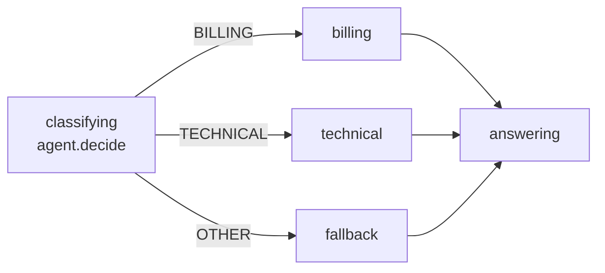
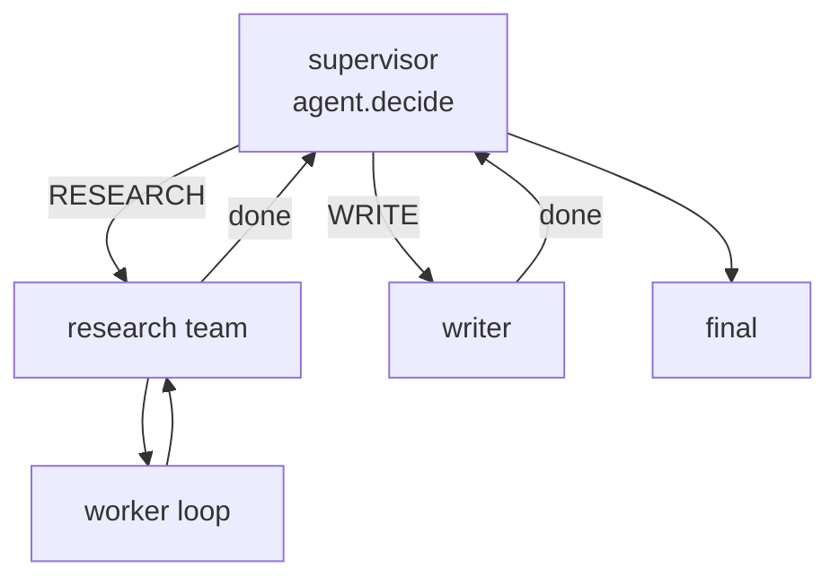
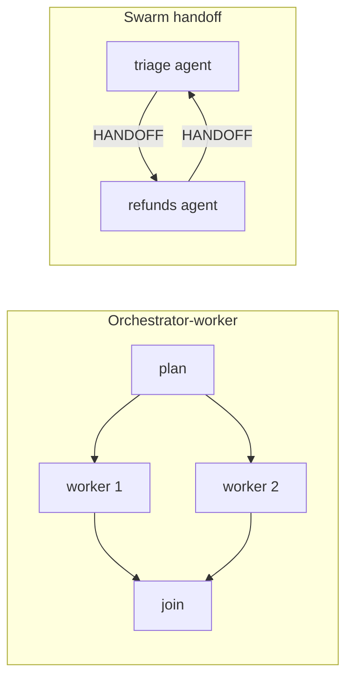

> **Alpha:** `@statelyai/agent` 2.0 is in alpha. APIs can change between releases; pin an exact version. Feedback: [github.com/statelyai/agent](https://github.com/statelyai/agent/issues).

Every well-known agent pattern is a control-flow shape: a loop, a branch, a fan-out, a handoff. This library makes each one an explicit XState machine you can read, test, and run. Below is a use-case map: pick a pattern, open its example, copy the one file.

## Lifting an example

Each pattern is a single self-contained `index.ts`: no shared harness, no local imports. To lift one:

1. Copy the one example file into your project as `index.ts`.
2. Install the runtime deps (the provider package major must match your installed `ai` major; this repo is on `ai@6`, so `@ai-sdk/openai@3`, not 4):

   ```sh
   pnpm add @statelyai/agent@alpha ai@^6 zod@^4 xstate@6.0.0-alpha.25 @ai-sdk/openai@^3
   pnpm add -D @types/node typescript tsx
   ```

3. The examples use Node globals (`process`, `console`, `import.meta.url`), so give TypeScript a `tsconfig.json` with `"module"`/`"moduleResolution"` set to `nodenext`, `"strict": true`, and `"types": ["node"]`.
4. Run it: `OPENAI_API_KEY=... npx tsx index.ts` (or swap in [any host](hosts.md)).

<!-- peer ranges from package.json#peerDependencies and example schema dependency from package.json#devDependencies -->

Peer ranges from `@statelyai/agent`: `ai@^6.0.67`, `xstate@>=6.0.0-alpha.25 <6.0.0`, optional `@opentelemetry/api@^1`. The examples use Zod 4 directly. The `@alpha` tag floats, so pin the exact version it installs once you have a build that works.

## Running from the repo

Examples live under `examples/`, one flat directory per example with an `index.ts` entrypoint. Clone the repo, install, then run any one directly:

```bash
OPENAI_API_KEY=... npx tsx examples/<name>/index.ts
```

- Every example is dual-mode: run it against a real model as above, or drive it with injected mock executors in a test (no key, no network).
- Most expect `OPENAI_API_KEY`; each file notes what it needs at the top. `anthropic-sdk-host` wants `ANTHROPIC_API_KEY`; the two Cloudflare examples target a Workers runtime, not Node/`tsx`.
- Swap the host without touching the machine ([Use in any stack](any-stack.md)). The exhaustive index, with framework-comparison notes, is [examples/README.md](../examples/README.md).

## Core ideas

The core ideas: text requests, decisions, messages, and JSON authoring.

- [twenty-questions](../examples/twenty-questions/index.ts): a decision loop where the model picks one legal event (ASK or GUESS) per turn; guard-enforced legality, machine-held score, play-again reset.
- [joke](../examples/joke/index.ts): a minimal streaming text workflow.
- [email-drafter](../examples/email-drafter/agent-logic.ts): reusable text logic, parts-based [messages](messages.md), schema-typed state and transition meta.
- [game-agent](../examples/game-agent/index.ts): `allowedEvents` narrowed as a function of input, gating moves by HP.
- [go-fish](../examples/go-fish/index.ts): hidden-information play with a checking-win → agent → human loop; the model chooses requests, the machine enforces the rules.
- [json-agent](../examples/json-agent/index.ts): a full workflow (decision, text request, idle human step) authored as a real `.json` file. See [Machines as data](machines-as-data.md).
- [described-workflow](../examples/described-workflow/index.ts): a plain XState machine with zero invokes (prompts live in state `description`s and `meta`), run via `runAgent`'s `getRequests` option.

**Canonical example: [`twenty-questions`](../examples/twenty-questions/index.ts).**

## Reasoning and tool loops

For tool use, start with **Tool calling**: your SDK runs the tool loop inside one request, in one machine state. **ReAct** is the same loop unrolled into explicit states, for when individual turns need gating (approval before a tool, a spend guard, a snapshot mid-loop).

- **Tool calling** ([tool-calling](../examples/tool-calling/index.ts)): the SDK's loop runs inside a state you control, bounded by `metadata.maxSteps`.
- **ReAct** ([react-agent](../examples/react-agent/index.ts)): every turn is gateable, persistable, and inspectable, under a step-budget guard.
- **Plan-and-execute** ([plan-and-execute](../examples/plan-and-execute/index.ts)): structured planner output; execution states iterate the plan.
- **Reflection** ([reflection-writer](../examples/reflection-writer/index.ts)): generate and critique are two states; a guard caps revisions.
- **Evaluator-optimizer** ([ai-sdk-evaluator-optimizer](../examples/ai-sdk-evaluator-optimizer/index.ts)): the scoring gate is a guard, so the loop terminates by construction.
- **Self-correcting codegen** ([code-assistant](../examples/code-assistant/index.ts)): a sandboxed check actor and a `maxAttempts` bound ending in an explicit `failed` outcome.
- **Tree search (LATS)** ([lats](../examples/lats/index.ts)): selection, expansion, and reflection scoring as separate states under a rollout budget.

**Canonical example: [`react-agent`](../examples/react-agent/index.ts).**

## Retrieval

- **RAG** ([rag](../examples/rag/index.ts)): retrieve and answer are separate typed states; conversational memory lives in context.
- **Corrective RAG (CRAG)** ([corrective-rag](../examples/corrective-rag/index.ts)): self-correction as explicit branch states, not buried conditionals.
- **Adaptive RAG** ([adaptive-rag](../examples/adaptive-rag/index.ts)): routing, grading, and a bounded query rewrite each get their own state.
- **Deep research** ([deep-research](../examples/deep-research/index.ts)): researchers spawn per query; coverage reflection gates one optional follow-up.
- **SQL agent** ([sql-agent](../examples/sql-agent/index.ts)): query generation, DB execution, and synthesis are separately testable states.

**Canonical example: [`corrective-rag`](../examples/corrective-rag/index.ts).**

## Routing and chaining

Routing is one decision state whose legal events are the branches. Each branch is a real state, so an unreachable branch is a lint finding, not a silent dead end.



- **Routing** ([ai-sdk-routing](../examples/ai-sdk-routing/index.ts)): the route is a decision over legal events; each branch is its own state.
- **Prompt chaining** ([ai-sdk-marketing-chain](../examples/ai-sdk-marketing-chain/index.ts)): a linear state sequence, each link independently typed and inspectable.
- **Parallel review** ([ai-sdk-parallel-review](../examples/ai-sdk-parallel-review/index.ts)): parallel states fan out; the join is a plain aggregation state.
- **Triage** ([triage](../examples/triage/index.ts)): structured output validated against a schema before it leaves the state.

**Canonical example: [`ai-sdk-routing`](../examples/ai-sdk-routing/index.ts).**

## Multi-agent

A supervisor is a routing state over typed workers, and the graph is the org chart. One level up, hierarchical teams nest the same shape: each team is a machine with a typed boundary, and the coordinator can send one bounded revision round back down.



Orchestrator-worker fans the same idea out in parallel and joins deterministically. Swarm handoff drops the hub entirely: agents are peers and a handoff is a transition, persisted across turns.



- **Supervisor** ([supervisor](../examples/supervisor/index.ts)): a routing request's structured output hands off to a typed worker; the graph is the org chart.
- **Swarm handoff** ([swarm-handoff](../examples/swarm-handoff/index.ts)): handoffs are transitions between typed child actors, persisted across turns.
- **Orchestrator-worker** ([ai-sdk-orchestrator-worker](../examples/ai-sdk-orchestrator-worker/index.ts)): fan-out and join are plain `Promise.all` over host actors.
- **Fan-out (map-reduce)** ([fan-out](../examples/fan-out/index.ts)): dynamic parallelism from a planner, then a deterministic reduce state.
- **Hierarchical teams** ([hierarchical-teams](../examples/hierarchical-teams/index.ts)): each team is a nested machine with a typed boundary.
- **Whole-org workflow** ([trading-team](../examples/trading-team/index.ts)): one composite workflow whose reject-and-revise loop is states, not retries.
- **Sub-agents** ([subflows](../examples/subflows/index.ts), [ai-sdk-sub-agents](../examples/ai-sdk-sub-agents/index.ts), [debate-sub-agents](../examples/debate-sub-agents/index.ts)): each child keeps its own executor binding; parents stay typed against results.

**Canonical example: [`supervisor`](../examples/supervisor/index.ts).** See [Multi-agent](multi-agent.md) for sub-agents and child actors.

## Control and safety

- **Human in the loop** ([human-in-the-loop](../examples/human-in-the-loop/index.ts)): an idle state is a durable pause; the snapshot is plain JSON you store anywhere.
- **Guardrails** ([guardrails](../examples/guardrails/index.ts)): gate states with guards, not prompt pleading; an illegal path is unreachable.
- **Context compaction** ([context-compaction](../examples/context-compaction/index.ts)): a `compacting` state folds old history into a running summary past a threshold.
- **Customer support** ([customer-support](../examples/customer-support/index.ts)): sensitive actions gate on an idle state; the model can't act past the guard.

Longer pauses and durable threads:

- [long-running-onboarding](../examples/long-running-onboarding/index.ts): a multi-day coordinator with durable typed state, two idle states, delegated IT provisioning, JSON snapshot resume.
- [file-snapshot-store](../examples/file-snapshot-store/index.ts): a file-backed snapshot store for durable threads across processes.

**Canonical example: [`human-in-the-loop`](../examples/human-in-the-loop/index.ts).** See [Human in the loop](human-in-the-loop.md) for the idle-first pause and snapshot resume.

## Hosts and runtimes

The same machines against different SDKs and runtimes. See [Hosts](hosts.md) and [Event log](event-log.md).

- [ai-sdk-host](../examples/ai-sdk-host/index.ts): running with Vercel AI SDK host actors.
- [ai-sdk-game-host](../examples/ai-sdk-game-host/index.ts): a step-path Vercel AI SDK runner that appends every model call to the event log.
- [openai-sdk-host](../examples/openai-sdk-host/index.ts): the same executor contract against the raw `openai` package (Chat Completions), no AI SDK in between.
- [anthropic-sdk-host](../examples/anthropic-sdk-host/index.ts): the same contract against the raw `@anthropic-ai/sdk` package (Messages API).
- [cloudflare-workers-ai-host](../examples/cloudflare-workers-ai-host/index.ts): a Workers AI host that persists only the event log and resumes by replay.
- [cloudflare-agent-host](../examples/cloudflare-agent-host/index.ts): a Cloudflare Agents host persisting snapshots in Durable Object state.
- [parallel-streams](../examples/parallel-streams/index.ts): fan-out over parallel worker streams relayed through a side channel.
- [sse-transport](../examples/sse-transport/index.ts): relaying provider stream chunks over an SSE transport.

**Canonical example: [`ai-sdk-host`](../examples/ai-sdk-host/index.ts).**

## Evaluation, migration, observability

- [simulated-user-evaluation](../examples/simulated-user-evaluation/index.ts): a target chatbot and simulated user alternate under a turn bound, then an independent judge scores the transcript.
- [retrofit](../examples/retrofit/index.ts): a tangled hand-rolled agent (`before.ts`) refactored stepwise into a machine, each step shippable, with `simulateAgent` tests pinning before/after behavior. The worked proof for [Migrating from a loop](from-a-loop.md).
- [langsmith-otel](../examples/langsmith-otel/index.ts): `createOtelTraceHandler` from `@statelyai/agent/otel` exporting real spans over OTLP to LangSmith (LangChain's hosted tracing product); keyless it exports to memory and prints the span tree. See [Observability](observability.md).

**Canonical example: [`retrofit`](../examples/retrofit/index.ts).**

## Related

- [examples/README.md](../examples/README.md): the exhaustive example index, including framework-comparison notes.
- [Use in any stack](any-stack.md): take any of these machines from local `runAgent` to your server or edge runtime, unchanged.
- [Migrating from a hand-rolled loop](from-a-loop.md): already have a `while` loop? Convert it step by step.
- [Thinking in state machines](thinking-in-state-machines.md): how to find the states before you pick a pattern.
