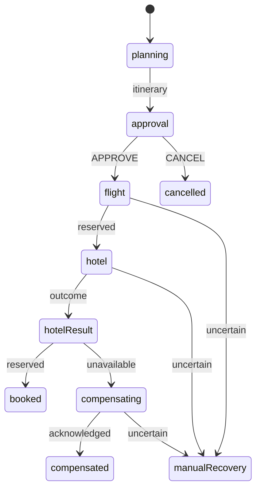

# Statechart policy examples

Three offline examples put consequential decisions in visible machine states. Each exports its machine and a runner accepting `RunAgentOptions`. Replace the scripted `generateText` executor with an SDK implementation; override booking actors through native XState `actors` bindings.

<!-- policy example catalog derived from examples/consensus-review, examples/booking-compensation, and examples/deadline-escalation -->

| Example | Machine policy | Verification |
| --- | --- | --- |
| [consensus-review](../examples/consensus-review/index.ts) | Three concurrent reviewers, two approvals required, failures abstain, human fallback | Concurrent starts, reordered completions, malformed votes, JSON restoration, native XState host parity |
| [booking-compensation](../examples/booking-compensation/index.ts) | Human approval before reservations; confirmed hotel unavailability compensates the flight; uncertain outcomes require reconciliation | No reservation before approval, compensation order, compensation failure, uncertain outcome, success/cancel paths |
| [deadline-escalation](../examples/deadline-escalation/index.ts) | Matching request identity and host timestamp determine whether approval or expiry is accepted | Deadline equality, stale identities, early expiry, late approval, JSON restoration |

Run without provider credentials:

```sh
pnpm tsx examples/consensus-review/index.ts
pnpm tsx examples/booking-compensation/index.ts
pnpm tsx examples/deadline-escalation/index.ts
```

The first CLI accepts three scripted votes. The second restores an approval checkpoint and demonstrates compensation using simulated bookings. The third restores a checkpoint and delivers a simulated scheduler expiry. Tests also run the alternate outcomes.

## Reviewer quorum

[Anthropic's voting pattern](https://www.anthropic.com/engineering/building-effective-agents) motivates independent reviews aggregated by policy. This example uses a two-of-three approval threshold, not unanimity: a security dissent can be outweighed. Change the machine policy if a particular reviewer must veto. Model votes do not prove a patch is safe.

Each reviewer is a named parallel region invoking the same typed request. No host `Promise.all` hides the topology. All regions reach a final state even when their request fails; the parent then counts votes. Human review persists both successful votes and abstentions.

The tests execute the same artifact through both `runAgent` and `createActor(provideExecutors(...))`. This establishes those host modes' behavior for this example; it is not certification of every model SDK.

## Booking compensation

[Microsoft's compensating-transaction pattern](https://learn.microsoft.com/en-us/azure/architecture/patterns/compensating-transaction) motivates explicit recovery after partially completed work. The model proposes an itinerary; deterministic states control approval, reservations, and compensation.



All reservation actors are simulated. A real host supplies idempotent implementations keyed by `bookingId` and operation name. A confirmed unavailable hotel returns `{ status: "unavailable" }`; an exception means the outcome is uncertain and leads to `manualRecovery`. Flight and cancellation exceptions also require reconciliation. The result preserves `bookingId` and known reservation references.

Compensation records an attempted business reversal; it does not roll back time. Snapshots cannot guarantee exactly-once external effects. A host must reconcile timeouts and crashes against the provider before retrying or compensating. The test checkpoint is before reservations, not in the middle of a partially committed provider request.

## Approval deadlines

[LangGraph interrupts](https://docs.langchain.com/oss/javascript/langgraph/interrupts) provide a useful comparison for persisted human waits. This example adds a scheduler-owned deadline with a machine-owned acceptance rule.

Persist the `awaitingApproval` checkpoint before scheduling expiry. Store an absolute deadline, use an authenticated host clock for `observedAt`, and correlate every delivery with `requestId`. Never trust a client to supply the timestamp. Approval requires `observedAt < deadline`; expiry requires `observedAt >= deadline`.

Serialize deliveries per request, or use storage compare-and-swap with conflict handling. Two independent resumes of one snapshot can otherwise produce conflicting outcomes. Retry scheduler deliveries that arrive before the waiting checkpoint exists. Scheduling, authentication, durable storage, and delivery retries belong to the host.

This example is marked manual in the demo catalog because generic chat cannot supply that clock/scheduler contract. Its CLI is fully offline. It exports an ordinary XState machine that a dedicated host can visualize and execute.

## Visualization and validation

Every example exposes named states, typed inputs/events, and schema-validated model output. The tests require `lintAgentMachine` to report no structural errors. These checks establish specific paths and structure; they are not exhaustive safety proofs. Payload-sensitive guards, provider side effects, and concurrent storage require their own verification.
