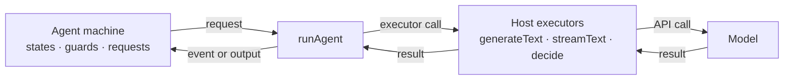

# Stately Agent

**Make invalid agent actions impossible.**

Agent logic as state machines: deterministic, inspectable, resumable, runs anywhere. The machine owns control flow; the model only ever picks a legal event. Testing, inspection, and visualization fall out for free.

Stately Agent adds model requests and decisions to XState:

- The machine defines what the agent can do.
- Your application chooses the model, runs the requests, and stores the state.
- The model proposes an event; the machine decides whether it is allowed and what happens next.

Stately Agent 2 is in alpha. APIs may change before the stable release.

[Documentation](https://stately.ai/docs/agents) · [Examples](examples/README.md) · [XState](https://github.com/statelyai/xstate)

## Three starting points

- **Author a new agent.** Build a machine from states, decisions, and typed requests; run it locally with `runAgent`, test it with no API key, then use it in any framework or runtime with zero machine changes. See the [Quickstart](docs/quickstart.md) and [Use in any stack](docs/any-stack.md).
- **Retrofit an existing agent.** Turn a `while` loop into a machine: your SDK calls, tools, and retry code become the executors; the machine replaces only the control flow. See [Migrating from a hand-rolled loop](docs/from-a-loop.md).
- **Copy a known pattern.** ReAct, reflection, plan-and-execute, RAG, supervisor, and more, each a single runnable file you lift in 60 seconds. See [Agent patterns](docs/patterns.md).

## Install

<!-- install command matching the package prerelease channel and package.json peers -->

```sh
pnpm add @statelyai/agent@alpha xstate@alpha zod ai@^6 @ai-sdk/openai@^3
```

Requirements:

- Node 22.18 or newer, and XState v6 alpha.25 or newer.
- The package is ESM-first. CommonJS builds are published too, so `require()` works.
- Provider packages must match your `ai` major: `@ai-sdk/openai@^3` pairs with `ai@^6`. A bare `@ai-sdk/openai` resolves to `@latest`, which can mismatch the `ai` peer.

## Quick start

<!-- refund decision example using setupAgent, agent.decide, a machine guard, and the AI SDK runAgent host -->

This agent reviews refund requests. The model may propose an automatic refund, but the state machine owns the $100 limit.

```ts
import { openai } from "@ai-sdk/openai";
import { runAgent, setupAgent } from "@statelyai/agent";
import { createAiSdkExecutors, defineModels } from "@statelyai/agent/ai-sdk";
import { z } from "zod";

const models = defineModels({
  fast: openai("gpt-5.4-mini"),
});

const agentSetup = setupAgent({
  models,
  context: z.object({
    request: z.string(),
    amount: z.number(),
  }),
  input: z.object({
    request: z.string(),
    amount: z.number(),
  }),
  output: z.object({
    outcome: z.enum(["refunded", "review"]),
  }),
  events: {
    AUTO_REFUND: {},
    REVIEW: z.object({ reason: z.string() }),
  },
});

const refundMachine = agentSetup.createMachine({
  context: ({ input }) => input,
  initial: "deciding",
  states: {
    deciding: {
      invoke: {
        src: "agent.decide",
        input: ({ context }) => ({
          model: "fast",
          system: "Choose AUTO_REFUND for eligible requests. Otherwise choose REVIEW.",
          prompt: `${context.request}\nAmount: $${context.amount}`,
          allowedEvents: ["AUTO_REFUND", "REVIEW"],
        }),
      },
      on: {
        AUTO_REFUND: ({ context }) => (context.amount <= 100 ? { target: "refunded" } : undefined),
        REVIEW: { target: "review" },
      },
    },
    refunded: {
      type: "final",
      output: () => ({ outcome: "refunded" }),
    },
    review: {
      type: "final",
      output: () => ({ outcome: "review" }),
    },
  },
});

const result = await runAgent(refundMachine, {
  input: {
    request: "I was charged twice for the same order.",
    amount: 75,
  },
  executors: createAiSdkExecutors({ models }),
});

if (result.status === "done") {
  console.log(result.output);
}
```

When the machine reaches `refunded`, the result is:

```text
{ outcome: 'refunded' }
```

The model chooses between the events allowed in `deciding`. The `AUTO_REFUND` transition only works when the amount is at most $100. If the model chooses it for a larger amount, the guard rejects the choice and the decision is tried again.

```ts
import { createScriptedExecutors } from "@statelyai/agent";

const result = await runAgent(refundMachine, {
  input: { request: "I was charged twice for the same order.", amount: 75 },
  executors: createScriptedExecutors({ decisions: [{ type: "AUTO_REFUND" }] }),
});
```

Scripted executors run the machine above end to end with no API key; swap in `createAiSdkExecutors({ models })` for a real model. See [Hosts and executors](docs/hosts.md).

## Architecture



The machine never talks to a model directly, so swapping `createAiSdkExecutors` for `createScriptedExecutors` (or your own functions) changes nothing about the agent.

The example above has one model decision and two final outcomes. Real machines add approval states, retries, parallel work, child agents, and long-running waits without changing how control flow is represented.

The core concepts (machines owning control flow, bounded model decisions, typed requests, host-run executors, storable snapshots, verified replay entries) are in the [documentation overview](docs/index.md).

## Examples

<!-- starter examples derived from examples/*/metadata.json and examples/index.ts -->

- [Twenty Questions](examples/twenty-questions) shows a model choosing legal events in a loop.
- [Go Fish](examples/go-fish) pits a model against a human while the machine enforces hidden-information game rules.
- [Human in the loop](examples/human-in-the-loop) pauses, stores a snapshot, and resumes after review.
- [Ticket triage](examples/triage) returns structured data from a model request.
- [JSON agent](examples/json-agent) runs a machine defined as data.

See [all examples](examples/README.md).

## Related

- [Machines](docs/machines.md)
- [Text requests](docs/text-requests.md)
- [Decisions](docs/decisions.md)
- [Human in the loop](docs/human-in-the-loop.md)
- [Testing and verification](docs/verify.md)
- [Evals](docs/evals.md)
- [Generating machines with an LLM](docs/generate-machines.md)
- [Hosts and executors](docs/hosts.md)
- [Models and providers](docs/models-and-providers.md)
- [Use in any stack](docs/any-stack.md)
- [The event log](docs/event-log.md)
- [Observability](docs/observability.md)
- [Usage and budgets](docs/usage-and-budgets.md)
- [Agent patterns](docs/patterns.md)
- [Migrating from a hand-rolled loop](docs/from-a-loop.md)
- [LangGraph vs agent machines](docs/langgraph-comparison.md)
